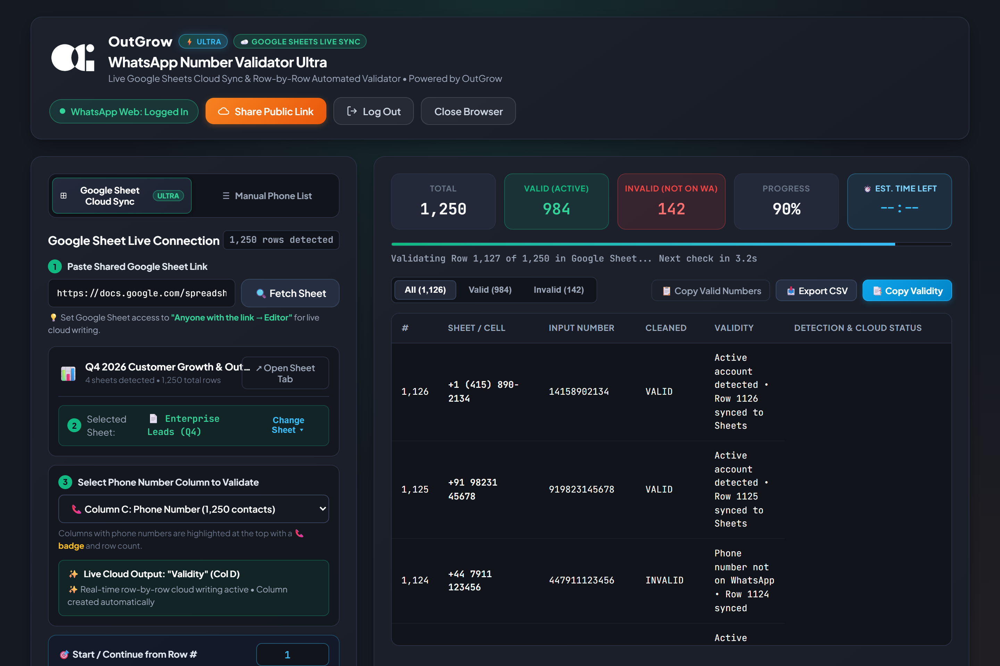
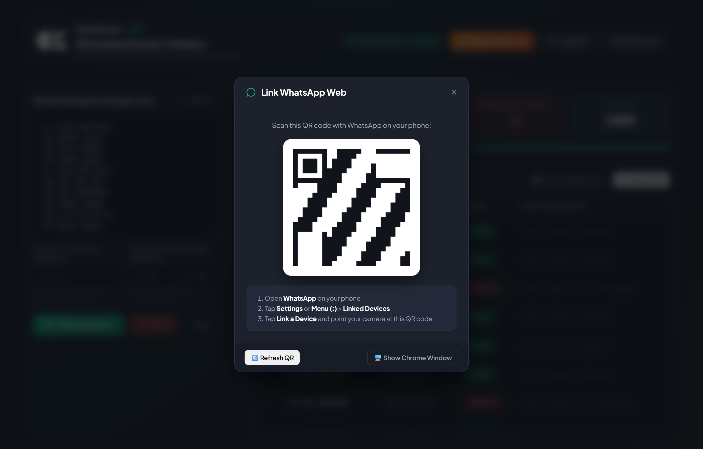

# 🍏 OutGrow | WhatsApp Phone Number Validator ULTRA (macOS Edition)
### *The Enterprise Evolution of OutGrow WhatsApp Validator Pro*

<div align="center">
  
  <br/>
  <p><strong>Enterprise-grade automated WhatsApp phone number verification & list hygiene platform built natively for macOS with live 2-way Google Sheets cloud synchronization.</strong></p>

  [-black?style=for-the-badge&logo=apple&logoColor=white)](https://github.com/)
  [](https://www.electronjs.org/)
  [](https://playwright.dev/)
  [-success?style=for-the-badge)](https://github.com/)
  [](https://workspace.google.com/)
  [](https://developer.mozilla.org/en-US/docs/Web/API/Server-sent_events)
  [-blueviolet?style=for-the-badge)](#-download--installation-for-macos)
</div>

---

## 📌 Executive Summary

**OutGrow WhatsApp Validator ULTRA (v1.0.0)** is the flagship enterprise desktop release of our validation suite, built natively for **macOS**. 

This release is the **ULTRA tier evolution** of our regular **OutGrow WhatsApp Validator Pro** previously published on GitHub. While our regular Pro edition excels at local manual number lists and static CSV file verifications, the **ULTRA Edition** eliminates all manual export/import friction by connecting directly to live Google Sheets—verifying international phone numbers on WhatsApp while writing validation results row-by-row in real time into cloud spreadsheets.

The app is compiled as a Universal macOS application, running natively with optimized performance on both **Apple Silicon (M1/M2/M3/M4)** and **Intel** Macs.

> **Note**: This repository serves as the official portfolio showcase and binary release portal for the Ultra Edition. The underlying automation engine and proprietary heuristic algorithms are maintained in a private repository.

---

## ⚡ Regular Pro Edition vs. ULTRA Edition Comparison

| Feature Capability | Regular Pro Edition (Previous Release) | ULTRA Edition (v1.0.0 Initial Launch) |
| :--- | :--- | :--- |
| **Primary Data Source** | Manual copy-paste or static local CSV file | **Live 2-way Google Sheet URL connection** |
| **Spreadsheet Tab Isolation** | Not available | **Auto-detects active tab via URL `#gid` & multi-tab switcher** |
| **Column Mapping** | Manual column specification | **Smart heuristic phone detection (📞 badge + row counts)** |
| **Result Write-Back** | Download local CSV after batch completes | **Live row-by-row cloud writing directly into Google Sheet** |
| **Crash & Interruption Safety** | In-flight progress lost if halted | **Zero data loss: every verified row is already saved in cloud** |
| **Auto-Resume Intelligence** | Must restart or manually slice remaining list | **Auto-detects first blank row in `Validity` column to resume** |
| **Multi-Sheet Workbooks** | Single list per execution | **Single tab OR multi-tab sequential batch processing** |
| **Dual-Mode Flexibility** | Manual list only | **Toggle between Google Sheets Live Sync & Manual/CSV mode** |
| **macOS Native Binary** | Universal DMG & ZIP | **Universal DMG & ZIP (Apple Silicon + Intel)** |

---

## 🚀 Ultra Edition Superpowers: What's New in v1.0.0

The **ULTRA Edition** brings comprehensive cloud synchronization, fault-tolerant execution, and cutting-edge safety features designed for high-volume operations:

### 1. ☁️ Live 2-Way Google Sheets Cloud Sync Engine
* **🔗 Direct Sheet Link Parsing & Tab Auto-Discovery**: Paste any shared Google Sheet URL. The engine immediately extracts the spreadsheet ID and parses URL hash parameters (`#gid`) to isolate and confirm the active sheet tab.
* **📞 Smart Heuristic Phone Column Detection**: Evaluates row samples across all columns using regex and numeric density algorithms. Automatically ranks and recommends the most likely phone column with a visible **📞 badge** and live row count.
* **✨ Automatic "Validity" Column Insertion**: Scans your worksheet for an existing `Validity` column. If absent, the engine automatically injects a new `Validity` column immediately to the right of your phone numbers.
* **⚡ Live Row-by-Row Cloud Writing**: Writes each verification outcome (`VALID` or `INVALID`) directly to Google's cloud servers in real time as each lookup completes.
* **🛡️ Zero Data Loss Guarantee**: If validation is paused, interrupted, or stopped, 100% of rows validated up to that second remain securely written and saved in your live Google Sheet.
* **🔁 Intelligent Auto-Resume**: Automatically inspects the `Validity` column for empty cells, calculates the exact row where you left off, and offers instant 1-click continuation—eliminating duplicate checks and saving time.
* **📑 Multi-Tab & "All Tabs" Batch Processing**: Choose to validate an individual sheet tab or trigger sequential automated batch processing across all worksheets in a workbook.
* **🎯 Custom Starting Row Offset**: Set any starting row number (e.g., skip header rows or start from row 500).

---

### 2. 🛡️ Enterprise Anti-Ban & Account Protection Engine
* **👁️ Real-Time DOM Heuristic Scanning**: Actively monitors WhatsApp Web's DOM for safety patterns (`unusual activity`, `rate limit`, `temporarily restricted`, `security check`, `try again in X`).
* **🛑 `SECURITY_STOP` Instant Safeguard**: Immediately aborts the validation queue upon detecting platform threshold warnings, protecting the user's WhatsApp account from temporary bans or restrictions.
* **⏳ Randomized Human-Emulation Pacing**: Configurable minimum and maximum delay intervals with decimal precision (e.g., 5.0s – 12.0s), introducing natural entropy between checks to emulate human behavior.
* **🌐 Intelligent Country Code Resolver**: Automatically prepends default country codes (e.g., `+1`, `+91`, `+44`) to local numbers missing an international prefix.

---

### 3. ⚡ Reactive Event-Driven SSE Streaming Pipeline
* **📡 Server-Sent Events (SSE)**: Pushes verification results to the frontend with sub-millisecond latency over a persistent HTTP stream with 20-second keep-alive heartbeats—zero polling overhead.
* **📊 Live Real-Time Telemetry**: Real-time progress bar, live ETA counter, total number count, and dynamic green/red valid/invalid badge counters.
* **🔍 Instant Search & Status Filtering**: Real-time filter buttons (`All`, `Valid`, `Invalid`) with instant full-text filtering.

---

### 4. 🍏 Universal macOS Native Architecture
* **Universal Binary for Apple Silicon & Intel**: Compiled natively for ARM64 (Apple M1/M2/M3/M4) and x64 Intel Macs, delivering ultra-low CPU and memory utilization.
* **Native macOS Menu Bar & Dock Integration**: Includes custom macOS application menus (`About`, `Services`, `Edit` with `Cmd+C`/`Cmd+V`/`Cmd+A` keyboard shortcuts, `Window`) and dynamic Dock icon integration.
* **Single-Instance Lock**: Prevents multiple overlapping instances from conflicting with the underlying Playwright Chromium session.

---

### 5. 📱 Seamless In-App QR Authentication & Session Persistence
* **Zero-Detached Windows**: WhatsApp Web QR code is rendered directly inside a sleek modal in the application shell.
* **Permanent Session Storage**: Securely stores authentication tokens and cookies in `~/Library/Application Support/OutGrow WhatsApp Validator Ultra/.wweb_session`—log in once, stay authenticated forever.
* **One-Click Account Switcher**: Built-in `Log Out` button allows instant unlinking to switch WhatsApp accounts with zero friction.

---

### 6. 🌐 Secure Remote Collaboration via Cloudflare Tunnel
* **One-Click HTTPS Public Sharing**: Integrated Cloudflare Tunnel provisions a secure public URL (`https://*.trycloudflare.com`) in seconds.
* **Remote Team Monitoring**: Distributed team members or managers can track live validation runs from their own browser without port forwarding or VPNs.

---

### 7. 🔄 Dual-Mode Operation
* Seamlessly toggle between **Google Sheet Cloud Sync (ULTRA)** for live cloud operations and **Manual Phone List** for quick copy-paste lookups and static CSV exports (`Copy Valid`, `Export CSV`).

---

## 📸 Application Showcase

### 1. Live Google Sheets Cloud Sync Dashboard (ULTRA)
*Dark Graphite & Emerald UI displaying real-time sheet connection, detected sheet tabs, smart phone column detection with 📞 badge, live row-by-row cloud writing into the "Validity" column, and SSE streaming metrics.*



---

### 2. In-App QR Code Authentication
*Seamless session linking directly inside the app shell—no detached browser windows required. Session cookies and local storage tokens persist securely in `~/Library/Application Support/OutGrow WhatsApp Validator Ultra/` across launches.*



---

### 3. Remote Cloudflare Tunnel Collaboration
*One-click instant HTTPS tunnel provisioning to share live validation runs and monitoring with distributed remote team members securely.*


---

## 🏗️ Technical Architecture & Engineering Highlights

```
┌─────────────────────────────────────────────────────────────┐
│                 Electron Desktop Application                │
│                                                             │
│  ┌───────────────────────┐       ┌───────────────────────┐  │
│  │   Chromium Renderer   │       │   macOS Main Loop     │  │
│  │   • Dark Graphite UI  │◄─────►│   • Single-Instance   │  │
│  │   • Live SSE Client   │       │   • Native macOS Menu │  │
│  └───────────▲───────────┘       └───────────▲───────────┘  │
└──────────────┼───────────────────────────────┼──────────────┘
               │ Event-Driven Streams (SSE)    │ IPC Bridge
┌──────────────▼───────────────────────────────▼──────────────┐
│                    Local Express API Service                │
│  • Pacing Controller    • Session Manager   • Export Engine │
└──────────────┬───────────────────────────────┬──────────────┘
               │ Orchestration                 │ Cloud Sync
┌──────────────▼──────────────┐ ┌──────────────▼──────────────┐
│  Playwright Automation Core │ │ Google Sheets Sync Engine   │
│  • Headless Chromium Engine │ │ • URL & Tab Discovery (#gid)│
│  • Anti-Ban Heuristic Engine│ │ • Smart Column Detection 📞 │
│  • Rate-Limit Graceful Stop │ │ • Live Row Cloud Writing ✨ │
└─────────────────────────────┘ └─────────────────────────────┘
```

- **Universal macOS Binary Architecture**: Compiled for both Apple Silicon (`arm64`) and Intel (`x64`) architectures, delivering native execution speed and optimal memory efficiency.
- **2-Way Google Sheets Cloud Sync Engine**: Directly inspects Google Sheets, injects a new `Validity` column to the right of your phone numbers if missing, and syncs results in real time with zero manual file transfers.
- **Native macOS Integration**: Custom macOS application menu (About, Edit with `Cmd+C`/`Cmd+V`/`Cmd+A` keyboard shortcuts, Window management) and native macOS Dock icon integration.
- **Playwright Automation Engine**: Direct low-level browser interaction with automated DOM selector fallback logic to handle WhatsApp Web UI updates seamlessly.
- **Proprietary Anti-Ban & Safety Safeguards (`SECURITY_STOP`)**: Real-time regex pattern monitors that actively scan WhatsApp's DOM for safety triggers (`unusual activity`, `rate limit`, `temporarily restricted`, `security check`). Automatically stops validation immediately to protect the user's phone number.
- **Event-Driven Reactive Streaming**: Uses **Server-Sent Events (SSE)** with persistent 20-second heartbeats, pushing real-time per-number verification results to the frontend with zero polling overhead.
- **Human Pacing Emulation**: Randomized min-to-max decimal delay intervals between lookups (e.g., 2.5s – 5.0s) simulating human keyboard and mouse latency.

---

## ⚡ Technical Specifications

| Component | Technology / Implementation |
| :--- | :--- |
| **Target OS** | macOS 12 Monterey or later (Apple Silicon M-Series & Intel) |
| **Frontend Shell** | Electron 41.x |
| **Automation Core** | Playwright Chromium Engine |
| **Cloud Synchronization** | Google Sheets Live 2-Way Sync Engine |
| **Backend Service** | Node.js + Express 4.x |
| **Streaming Protocol** | Server-Sent Events (SSE) |
| **Session Persistence** | `~/Library/Application Support/OutGrow WhatsApp Validator Ultra/.wweb_session` |
| **Packaging / Dist** | Electron-Builder (Universal `.dmg` & `.zip`) |
| **Networking** | Integrated Cloudflare Tunnel for secure HTTPS port forwarding |

---

## 🚀 Download & Installation for macOS

Pre-compiled, universal macOS packages are distributed directly under **Releases**:

1. Navigate to the [**Releases**](https://github.com/) section on the right side of this repository.
2. Download **`OutGrow WhatsApp Validator Ultra-1.0.0.dmg`** (or the `.zip` archive).
3. Double-click the `.dmg` file and drag **OutGrow WhatsApp Validator Ultra** into your **Applications** folder.

> [!NOTE]
> **First-Time macOS Launch Note (Apple Gatekeeper):**  
> Because this is a self-built open-source binary without a paid Apple Developer ID notarization certificate, macOS might show a warning on first launch: *"App cannot be opened because Apple cannot check it for malicious software"*.
>
> **To open:**
> 1. Right-click (or Control-click) the app in **Applications** and select **Open**.
> 2. Alternatively, open Terminal and run:
>    ```bash
>    xattr -cr "/Applications/OutGrow WhatsApp Validator Ultra.app"
>    ```

---

## ☁️ Automated Cloud Builds via GitHub Actions

This repository includes a preconfigured **GitHub Actions workflow** (`.github/workflows/build-mac.yml`):
1. Pushing commits or triggering **workflow_dispatch** spawns an official macOS runner (`macos-latest`).
2. GitHub Actions sets up Node.js 20, compiles the universal macOS `.dmg` and `.zip` installers, and attaches them under **Artifacts** for 1-click download.

---

## 🔒 Security & Safe Usage

- Built for legitimate contact database sanitization, customer onboarding verification, and database deduplication.
- Strictly adheres to human-simulated pacing recommendations to avoid triggering platform rate thresholds.
- All session data and authentication keys are stored exclusively in your local macOS user library and are never transmitted to external cloud servers.

---

## 📄 License & Rights

Copyright © 2026 OutGrow. All rights reserved.  
The source code and proprietary automation mechanisms of this project are private. Pre-built standalone binaries are distributed solely for evaluation and showcase purposes.
